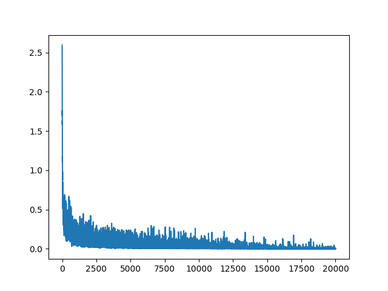

# Neural Network from Scratch

This project implements a fully functional Multi-Layer Perceptron (MLP) neural network from scratch using Python and NumPy. It demonstrates the core concepts of deep learning, including forward propagation, backpropagation, and gradient descent, without relying on high-level deep learning frameworks like PyTorch or TensorFlow.

## 🚀 Overview

The goal of this project is to build and train a neural network to recognize handwritten digits from the MNIST dataset. The implementation is modular, with separate classes for the network model, layers, and utility functions.

**Key Achievements:**
-   **Accuracy:** Achieved **98.24%** accuracy on the MNIST test dataset (improved from 97.91%).
-   **Test Loss:** Final test loss of **0.0552**.
-   **Pure Implementation:** Built entirely with NumPy for matrix operations.
-   **Advanced Features:** Implemented **Batch Normalization** from scratch.

## 🧠 Architecture

The neural network consists of an input layer, two hidden layers, and an output layer.

-   **Input Layer:** 784 neurons (corresponding to 28x28 pixel images).
-   **Hidden Layer 1:** 150 neurons with **Batch Normalization** and **ReLU** activation.
-   **Hidden Layer 2:** 150 neurons with **Batch Normalization** and **ReLU** activation.
-   **Output Layer:** 10 neurons with **Softmax** activation.

### Model Configuration
-   **Optimizer:** Stochastic Gradient Descent (SGD)
-   **Loss Function:** Cross Entropy Loss
-   **Batch Size:** 64
-   **Training Steps:** 20,000
-   **Learning Rate:** 0.1

## 📂 Implementation Details

The codebase is structured into several key files:

-   **`nn.py`**: The main driver script. It handles data loading, model initialization, the training loop, testing, and plotting results.
-   **`mlp.py`**: Contains the `MLP` class, which acts as a container for layers and manages the forward and backward passes. It now supports `train` and `test` modes to handle Batch Normalization correctly.
-   **`dense_layer.py`**: Implements individual fully connected layers.
    -   **Batch Normalization**: The standard bias addition (`z = Wx + b`) has been removed and replaced with Batch Normalization.
    -   It normalizes layer inputs using batch statistics (mean and variance) during training and running statistics during testing.
    -   Includes learnable **scale** (`batch_weights`) and **shift** (`batch_biases`) parameters instead of standard biases.
-   **`functions.py`**: Provides utility functions such as loss calculations and derivatives.

## 📊 Results & Performance

The model was trained for 20,000 iterations. Below is the training loss curve, showing the convergence of the model over time.



> [!NOTE] 
> The initial training loss is observed to be very close to the theoretical valid initial loss of **2.302** (calculated as `-ln(0.1)` for 10 classes), which confirms that the weights were initialized correctly.

### Final Statistics & Comparison
The introduction of Batch Normalization significantly improved convergence and final accuracy.

| Metric | With Batch Norm (Current) | Without Batch Norm (Previous) |
| :--- | :--- | :--- |
| **Test Accuracy** | **98.24%** | 97.91% |
| **Test Loss** | **0.0552** | 0.0784 |

## 🛠️ Usage

1.  **Dependencies**: Ensure you have Python installed along with `numpy` and `matplotlib`.
    ```bash
    pip install numpy matplotlib
    ```

2.  **Run Training**: Execute the `nn.py` script to start training the model.
    ```bash
    python nn.py
    ```
    This script will:
    -   Load the MNIST dataset.
    -   Train the MLP network.
    -   Save the trained model to `model_mnist.npz`.
    -   Save performance stats to `stats.json`.
    -   Display the training loss graph.

3.  **Output**: The script prints the training progress and final test accuracy to the console.

## 📝 Note
The data loading in `nn.py` assumes `datasets/mnist_train.csv` and `datasets/mnist_test.csv` exist. Ensure these files are present in the `datasets` directory.
